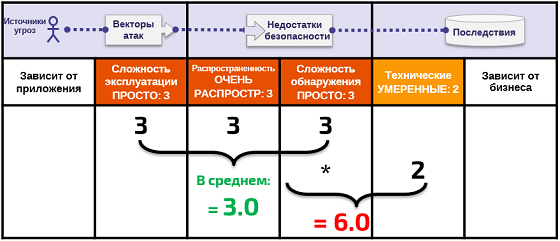

# +У Об угрозах

## Степень опасности уязвимостей

Методика оценки степени опасности уязвимостей для списка Топ-10 основана на [Методике оценки рисков OWASP](https://www.owasp.org/index.php/OWASP_Risk_Rating_Methodology). Для каждой категории угроз оценивались характерные для стандартного веб-приложения недостатки, исходя из факторов их вероятности и риска. Затем угрозы группировались по степени опасности для веб-приложений. Список уязвимостей обновляется с каждым новым выпуском Топ-10, по мере изменения среды и условий эксплуатации.

[Методика оценки рисков OWASP](https://www.owasp.org/index.php/OWASP_Risk_Rating_Methodology) описывает множество факторов, помогающих оценить опасность обнаруженной уязвимости. Топ-10 предоставляет лишь обобщенные данные, а не информацию о конкретных уязвимостях в реальных приложениях и API. Поэтому никто кроме владельца или менеджера приложения не сможет точно оценить риски, угрожающие конкретному приложению. Только вы обладаете наиболее полными знаниями, чтобы судить о критичности ваших приложений и данных, наличии возможных угроз, а также принципах работы и использования вашей системы.

Наша методика определяет три фактора вероятности наличия уязвимости (распространенность, сложность обнаружения и сложность эксплуатации) и один фактор ее опасности (технические последствия). Уровень критичности каждого фактора классифицируется от 1 (низкий) до 3 (высокий) и определяется специальными терминами. Распространенность, как правило, не требует расчета. Статистические данные по распространенности, предоставленные организациями (см. Благодарности на стр. 24), были обработаны и интегрированы в список Топ-10. Затем эти данные были объединены с двумя другими факторами вероятности (сложность обнаружения и сложность эксплуатации) для расчета вероятности наличия каждой уязвимости. Полученное значение было умножено на среднее значение тяжести технических последствий для определения совокупной опасности каждого пункта списка Топ-10 (чем выше результат, тем выше опасность). Сложность обнаружения и эксплуатации, а также последствия рассчитывались на основе CVE, связанных с каждой категорией Топ-10.

**Примечание**:  данный подход не учитывает источники угроз, а также технические особенности отдельных приложений. Любой из этих факторов может в значительной степени повлиять на общую вероятность обнаружения и эксплуатации злоумышленником уязвимости. Классификация также не учитывает реальные последствия для бизнеса. Каждая организация должна сама решить насколько небезопасными могут быть ее приложения и API с учетом сложившихся традиций, отрасли применения и нормативной базы. В задачи Топ-10 OWASP не входит анализ угроз для конкретной организации.

Ниже представлен расчет степени опасности **A6:2017-Некорректной настройки параметров безопасности**

